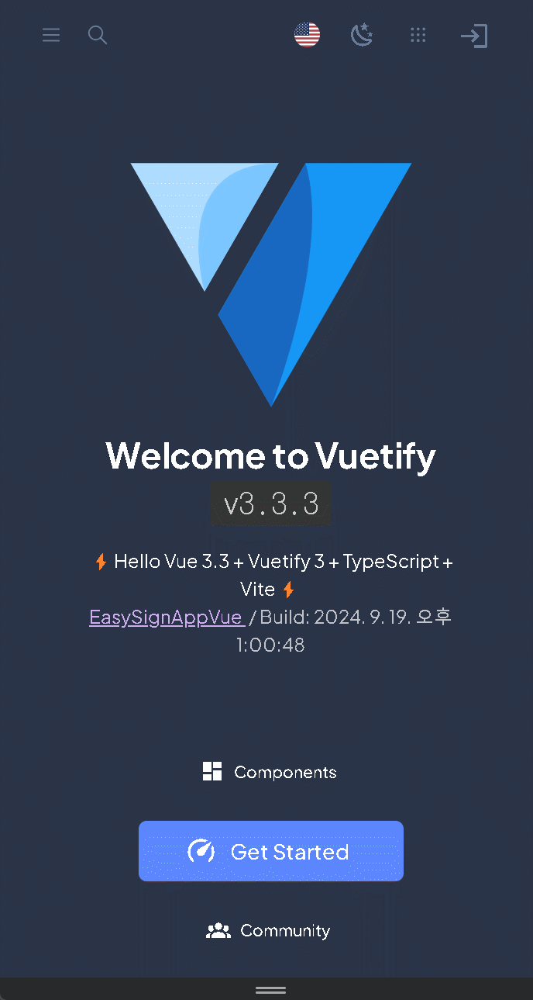

# 심플 로그인 프론트엔드

이 프로젝트는 Vue 3 + Typescript + Vite + Vuetify 3.3로 개발된 간단한 로그인 시스템의 프론트엔드 레포지토리입니다.

백엔드는 **EasySignApp** 레포지토리로 구현되어 있으며, 이를 통해 REST API 인터페이스로도 이용 가능합니다.

---

## 목차
1. [구현 내용](#구현-내용)
2. [화면](#화면)

---

## 구현 내용

다음 기능들이 프로젝트에 구현되었습니다:

- **Pinia 추가**: JSON Web Token 등을 Pinia 스토리지 관리 추가.
- **OAuth2 추가**: Google, Naver, Kakao 소셜 로그인 기능 구현 추가.
- **화면 컴포넌트화**: 메인, 회원가입, 로그인, 회원정보 수정 등의 주요 화면 컴포넌트화.
- **다중언어 및 테마 추가**: 글로벌 사용자를 위한 다중 언어 및 테마 지원.
- **페이지 권한 추가**: 마이페이지등 로그인한 유저만 페이지 접근 가능 추가.
- **CSRF 공격 방지**: 보안을 위한 필수 요소로 공격 방지 기능 추가.
---

## 화면
다음은 화면 이미지입니다.

| 메인 화면 | 회원가입 화면 |
| --- | --- |
|  |  |

| 프로필 수정 화면 | OAuth 로그인 화면 |
| --- | --- |
|  |  |
